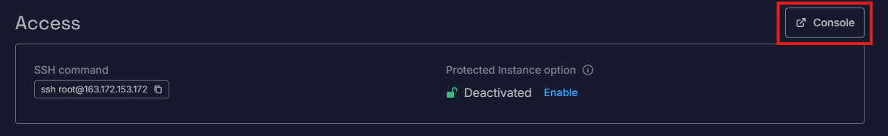
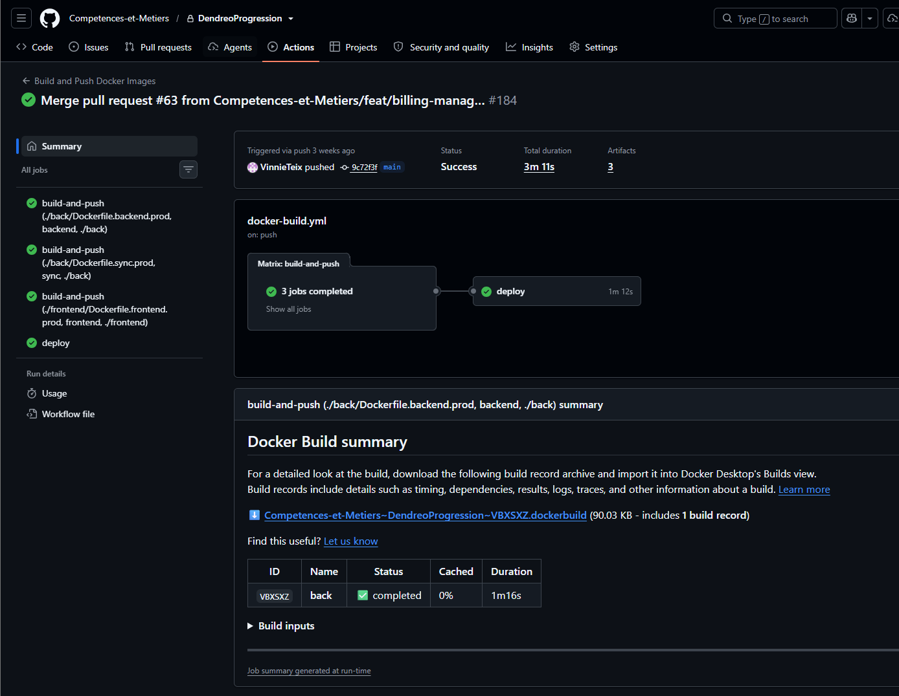

# Onboarding : faire tourner l'application (et où trouver les infos techniques)

Ce document donne les bases indispensables pour que l'application continue de
fonctionner — par exemple payer l'hébergement Scaleway — même sans connaissances
techniques. La partie plus technique (code, déploiement) est volontairement placée
à la fin : vous n'avez pas besoin de la comprendre, elle est là pour que tout soit
prêt le jour où une personne technique (développeur·se) reprend le projet.

L'application repose sur deux services principaux : **Scaleway** (hébergement) et
**GitHub** (code + déploiement).

## 1. De quoi s'agit-il

Une application qui suit la progression et l'engagement des participants aux
formations, en récupérant les données du LMS Dendreo (et de HubSpot) et en les
affichant dans un tableau de bord. Voir le [README.md](../README.md) à la racine
pour le détail des fonctionnalités.

## 2. Scaleway — l'hébergement

Scaleway est l'entreprise qui héberge l'application : le serveur, la base de
données, les sauvegardes, le stockage. **C'est là que se paie l'hébergement** — si la
facture Scaleway n'est plus honorée, le site s'arrête.

**Accès** : Victor crée les comptes admin sur la console Scaleway
(console.scaleway.com). Une fois connecté·e, le serveur (VPS) se trouve dans la
section Instances.



Depuis cette page, le bouton **Console** (en haut à droite) ouvre un accès direct au
serveur dans le navigateur, sans rien installer — c'est la porte de secours si plus
personne n'a de connexion SSH valide.

### Se donner un accès SSH personnel *(technique)*

SSH est la façon dont une personne technique se connecte au serveur pour
l'administrer. Vous n'avez pas besoin de faire cette manipulation vous-même, mais
voici la marche à suivre pour la personne technique qui en aura besoin.

Un **terminal** est une fenêtre où l'on tape des commandes texte au lieu de cliquer :
- Sur Mac : ouvrir l'application **Terminal** (raccourci Cmd+Espace, taper
  « Terminal », puis Entrée)
- Sur Windows : ouvrir **PowerShell**, ou **Git Bash** si Git est installé

Une fois le terminal ouvert :

**1. Sur sa propre machine**, générer une paire de clés (une clé « publique » à
partager, une clé « privée » à garder secrète — ne jamais la partager) :

```bash
ssh-keygen -t ed25519 -f ~/.ssh/deploy_key -C "deploy-key-$(hostname)"
cat ~/.ssh/deploy_key.pub
```

Appuyer sur Entrée à chaque question posée (pas besoin de mot de passe
supplémentaire). La deuxième commande affiche la clé publique, qui commence par
`ssh-ed25519 AAAA...` — copier cette ligne en entier.

**2. Ouvrir le serveur via le bouton Console** de la capture ci-dessus (cela ouvre
une session déjà connectée en tant qu'administrateur `root`, directement dans le
navigateur — pas besoin de terminal local pour cette étape), puis coller ces
commandes une par une, en remplaçant `ssh-ed25519 AAAA... deploy-key-<hostname>` par
la clé copiée à l'étape 1 :

```bash
su - deploy
mkdir -p ~/.ssh && chmod 700 ~/.ssh
echo "ssh-ed25519 AAAA... deploy-key-<hostname>" >> ~/.ssh/authorized_keys
chmod 600 ~/.ssh/authorized_keys
exit
```

**3. Depuis sa propre machine**, on peut désormais se connecter directement, sans
repasser par la Console web :

```bash
ssh -i ~/.ssh/deploy_key deploy@163.172.153.172
```

(C'est l'utilisateur `deploy`, pas `root` ni `ubuntu`, qui est configuré pour
l'usage courant.) Ceci est indépendant du secret GitHub `VPS_SSH_KEY` (la clé dédiée
que la CI utilise pour déployer automatiquement) — on ajoute simplement une deuxième
clé autorisée dans le même fichier `authorized_keys`, sans rien toucher côté GitHub.

### Ce qui tourne sur le serveur *(technique)*

- Un seul VPS, région `fr-par-1` (Paris — choisi pour la conformité RGPD des données
  de formation françaises), Ubuntu 22.04. Domaine
  `dendreo.competences-et-metiers.com` (DNS chez Hostinger), SSL via Let's
  Encrypt/certbot.
- `docker-compose.prod.yml` fait tourner toute la stack : `nginx`, `backend`
  (FastAPI), `sync` (jobs cron de synchronisation Dendreo/HubSpot), `postgres`,
  `redis`, `netdata` (monitoring).
- **IaC** (`infra/`) : Terraform provisionne le VPS, son groupe de sécurité, et un
  bucket Object Storage pour les sauvegardes. Ansible le configure, via 4 rôles —
  `common` (durcissement OS/pare-feu/utilisateur deploy), `docker`, `app` (fichiers
  compose, nginx, secrets, SSL), `backup` (rclone + cron pg_dump).
- **Sauvegardes** : `pg_dump` quotidien vers Scaleway Object Storage via rclone,
  rétention de 30 jours.

`setup-server.sh` et `deploy-prod.sh` à la racine du repo couvrent la configuration
initiale du serveur et les déploiements manuels, si le VPS doit un jour être
reconstruit de zéro.

## 3. GitHub — le code et le déploiement

Met à jour automatiquement l'application à chaque modification validée du code.
Nécessite un compte GitHub avec accès au dépôt pour toute personne qui doit y
toucher.



*(Ce qui suit est technique — utile pour la personne qui reprendra le
développement.)*

Un seul workflow : [.github/workflows/docker-build.yml](../.github/workflows/docker-build.yml).

- À chaque push sur `main`/`dev` (ou un tag `v*`) : construit les 3 images Docker
  (backend, sync, frontend) et les pousse vers GHCR (registre de conteneurs GitHub).
- Sur push vers `main` **spécifiquement**, un second job déploie aussi : il attend la
  fin d'une éventuelle synchronisation en cours, se connecte en SSH au VPS, récupère
  les nouvelles images, redémarre la stack avec `docker compose`, nettoie les
  anciennes images, et vérifie `/health`.
- **Merger sur `main`, c'est déployer.** Il n'y a pas d'étape de release manuelle
  séparée pour les changements normaux.
- ⚠️ **À noter** : ce workflow ne lance pas de suite de tests automatisés — c'est
  uniquement du build + push + déploiement. Le repo a des hooks `pre-commit` locaux
  (formatage `black`, lint `flake8`, garde-fous anti-fichiers `.env`/cache) mais ils
  ne s'exécutent pas en CI aujourd'hui.

## 4. Où se trouvent toutes les clés et tokens

Liste complète de tout ce qui permet de faire fonctionner l'application, et où le
trouver. Vous n'avez pas besoin de comprendre à quoi chaque ligne sert précisément —
gardez cette liste à jour et transmettez-la telle quelle à la personne qui vous
succèdera.

| Élément | Où le trouver | À quoi ça sert |
|---|---|---|
| Compte Scaleway (facturation + console) | console.scaleway.com — comptes créés par Victor | Payer l'hébergement, gérer le serveur |
| Clés API Scaleway (`SCW_ACCESS_KEY`, `SCW_SECRET_KEY`, `SCW_DEFAULT_ORGANIZATION_ID`, `SCW_DEFAULT_PROJECT_ID`, `Root_key`) | Fichier dans **SharePoint → IT** | Permettent aux outils techniques (Terraform) de gérer le serveur automatiquement |
| Clé privée SOPS (`age`) | Fichier dans **SharePoint → IT** | Déchiffre les mots de passe/clés techniques stockés dans le code (`secrets/*.enc`) |
| Secrets GitHub Actions (`VPS_HOST`, `VPS_USER`, `VPS_SSH_KEY`, `GHCR_PAT`, `AZURE_AD_CLIENT_ID`, `AZURE_AD_TENANT_ID`, `AZURE_AD_REDIRECT_URI`) | Repo GitHub → **Settings → Secrets and variables → Actions** | Permettent au robot de déploiement automatique de se connecter au serveur et de construire l'application |
| Configuration de production (mots de passe base de données, clé API Dendreo, clé API HubSpot, clés de sécurité) | Fichier `.env.prod` directement sur le serveur (`/opt/dendreo/.env.prod`), copie chiffrée dans `secrets/env.prod.enc` du repo | Fait fonctionner l'application (connexion à la base, à Dendreo, à HubSpot) |
| Compte GitHub (accès au code) | github.com, organisation **Competences-et-Metiers** | Voir/modifier le code, déclenche les déploiements |
| Nom de domaine (DNS) | Compte Hostinger — *propriétaire à confirmer avec le mainteneur actuel* | `dendreo.competences-et-metiers.com` pointe vers le serveur |
| Connexion « Se connecter avec Microsoft » | Portail Azure — *propriétaire à confirmer avec le mainteneur actuel* | Authentification des utilisateurs internes |

⚠️ Ces éléments donnent un accès complet à la facturation Scaleway et à tous les
secrets de l'application — à traiter comme des mots de passe root. Ne jamais les
copier dans le repo git, dans Slack/Teams ou dans un email.

ℹ️ Le fichier `.env.prod.example` à la racine du repo sert de modèle (juste les noms
de variables). Une ancienne clé HubSpot y apparaissait par erreur en clair — elle a
depuis été révoquée côté HubSpot et n'est plus utilisable. Cela reste une bonne
pratique à retenir : ne jamais laisser de vraie valeur dans un fichier `*.example`
avant de le committer.

### Comment les clés Scaleway et SOPS sont transmises

Les clés Scaleway et la clé privée SOPS sont déposées sous forme de fichiers dans le
**SharePoint, dossier IT**. Deux fichiers distincts :

- **Clés API Scaleway** :

  ```
  SCW_ACCESS_KEY=
  SCW_SECRET_KEY=
  SCW_DEFAULT_ORGANIZATION_ID=
  SCW_DEFAULT_PROJECT_ID=
  Root_key=
  ```

- **Clé privée age (SOPS)** — au format généré par `age-keygen`, à placer telle
  quelle sur la machine à `~/.config/sops/age/keys.txt` pour pouvoir déchiffrer les
  fichiers `secrets/*.enc` :

  ```
  # created: 2026-04-01T14:53:11+02:00
  # public key: age1XXX
  AGE-SECRET-KEY-XXXX
  ```

Une fois le nouveau collaborateur onboardé, envisager de faire tourner (régénérer)
ces clés côté Scaleway/age plutôt que de laisser une copie indéfiniment accessible
dans le SharePoint.

## 5. Documentation technique du projet *(pour la personne qui reprendra le développement)*

Cette section ne vous concerne pas au quotidien — elle sert de point de départ pour
la personne technique qui reprendra le projet plus tard. Rien à faire ici pour
l'instant.

- [docs/README.md](README.md) — index de toute la documentation technique
- [docs/deployment/](deployment/) — guides de déploiement ; certains se recoupent ou
  sont anciens (`docs/archive/` contient ceux qui sont remplacés). La personne
  technique devra croiser avec le code réel dans `infra/` et `.github/workflows/`
  plutôt que de faire confiance aveuglément à un document.
- [docs/features/](features/) — descriptifs de fonctionnalités spécifiques
- [back/AGENT.md](../back/AGENT.md) et [frontend/AGENT.md](../frontend/AGENT.md) —
  stack technique, structure et conventions du code, pensés aussi bien pour un
  développeur que pour un agent IA

### Où un agent IA trouve son contexte

Pointez-le vers `back/AGENT.md` / `frontend/AGENT.md` et le dossier `docs/` — c'est
le contexte durable et partagé qui vit avec le repo.

Un point à savoir : un assistant qui travaille sur la durée, comme Claude Code,
construit aussi sa propre **mémoire locale** des décisions d'infra et de l'état du
projet. Cette mémoire vit sur la machine/le compte où elle a été créée, pas dans git
— elle ne se transmet pas automatiquement à un nouveau collaborateur. Ce qui vaut la
peine d'être gardé doit être écrit dans `docs/` ou dans un `AGENT.md`.

## 6. Pour aller plus loin *(technique)*

| Sujet | Fichier |
|---|---|
| Guide de déploiement complet | [docs/deployment/DEPLOYMENT_GUIDE.md](deployment/DEPLOYMENT_GUIDE.md) |
| Conteneur sync / jobs cron | [docs/deployment/CONTAINER_SYNC_DEPLOYMENT.md](deployment/CONTAINER_SYNC_DEPLOYMENT.md) |
| Migrer la base de données entre machines | [docs/deployment/DATABASE_MIGRATION.md](deployment/DATABASE_MIGRATION.md) |
| Tunnel SSH pour du dev local sur des données proches de la prod | [docs/deployment/SSH_TUNNEL.md](deployment/SSH_TUNNEL.md) |
| Architecture/conventions backend | [back/AGENT.md](../back/AGENT.md) |
| Architecture/conventions frontend | [frontend/AGENT.md](../frontend/AGENT.md) |
| Terraform | `infra/terraform/` |
| Ansible | `infra/ansible/` |
